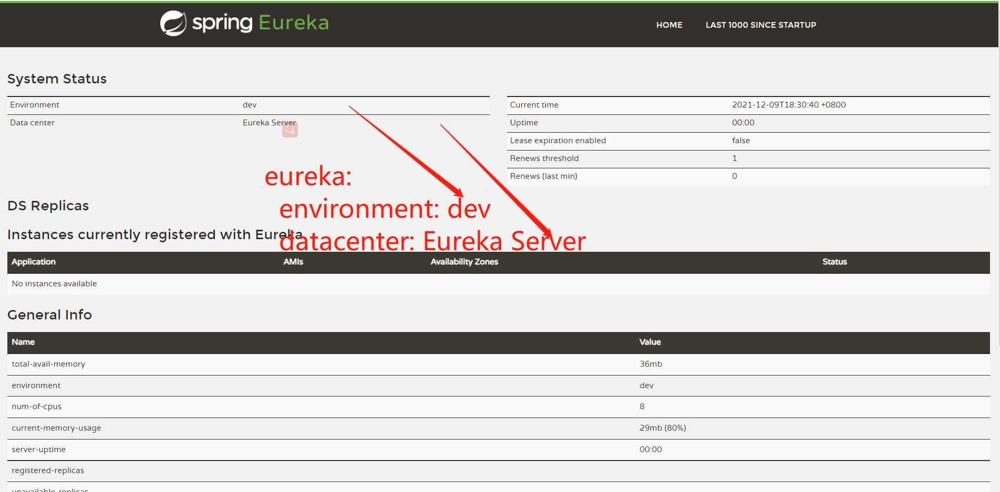
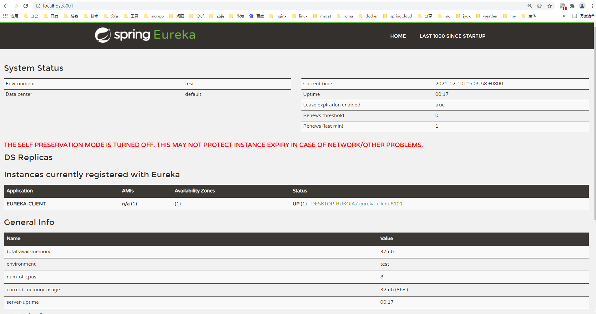

# Eureka

<p>

</p>

## 简介

在微服务架构中往往会有一个注册中心，每个微服务都会向注册中心去注册自己的地址及端口等信息，注册中心维护着服务名称与服务实例的对应关系。
每个微服务都会定时从注册中心获取服务列表，同时汇报自己的运行情况，这样当有的服务需要调用其他服务时，就可以从自己获取到的服务列表中获取实例地址进行调用，Eureka实现了这套服务注册与发现机制。
# 搭建Eureka注册中心
## 目录
- 添加依赖
``` 
<dependency>
    <groupId>org.springframework.cloud</groupId>
    <artifactId>spring-cloud-starter-netflix-eureka-server</artifactId>
</dependency>
```
- 在启动类上添加@EnableEurekaServer注解来启用Euerka注册中心功能
````
@EnableEurekaServer
@SpringBootApplication
public class EurekaServerApplication {

    public static void main(String[] args) {
        SpringApplication.run(EurekaServerApplication.class, args);
    }

}
````
- 在配置文件application.yml中添加Eureka注册中心的配置
````
server:
  port: 8001 #指定运行端口
spring:
  application:
    name: eureka-server #指定服务名称
eureka:
  instance:
    hostname: localhost #指定主机地址
  client:
    fetch-registry: false #指定是否要从注册中心获取服务（注册中心不需要开启）
    register-with-eureka: false #指定是否要注册到注册中心（注册中心不需要开启）
  server:
    enable-self-preservation: false #关闭保护模式
````

## 配置


#搭建Eureka客户端
- 新建一个eureka-client模块，并在pom.xml中添加如下依赖
````
<dependency>
    <groupId>org.springframework.cloud</groupId>
    <artifactId>spring-cloud-starter-netflix-eureka-client</artifactId>
</dependency>

<dependency>
    <groupId>org.springframework.boot</groupId>
    <artifactId>spring-boot-starter-web</artifactId>
</dependency>
````
- 在启动类上添加@EnableDiscoveryClient注解表明是一个Eureka客户端
````
@EnableDiscoveryClient
@SpringBootApplication
public class EurekaClientApplication {

    public static void main(String[] args) {
        SpringApplication.run(EurekaClientApplication.class, args);
    }

}
````
- 在配置文件application.yml中添加Eureka客户端的配置
````
server:
  port: 8101 #运行端口号
spring:
  application:
    name: eureka-client #服务名称
eureka:
  client:
    register-with-eureka: true #注册到Eureka的注册中心
    fetch-registry: true #获取注册实例列表
    service-url:
      defaultZone: http://localhost:8001/eureka/ #配置注册中心地址
````
- 查看注册中心http://localhost:8001/发现Eureka客户端已经成功注册


#搭建Eureka注册中心集群
##搭建两个注册中心
由于所有服务都会注册到注册中心去，服务之间的调用都是通过从注册中心获取的服务列表来调用，注册中心一旦宕机，所有服务调用都会出现问题。所以我们需要多个注册中心组成集群来提供服务，下面将搭建一个双节点的注册中心集群。

- 给eureka-sever添加配置文件application-replica1.yml配置第一个注册中心
````
server:
  port: 8002
spring:
  application:
    name: eureka-server
eureka:
  instance:
    hostname: replica1
  client:
    serviceUrl:
      defaultZone: http://replica2:8003/eureka/ #注册到另一个Eureka注册中心
    fetch-registry: true
    register-with-eureka: true
````
给eureka-sever添加配置文件application-replica2.yml配置第二个注册中心
````
server:
  port: 8003
spring:
  application:
    name: eureka-server
eureka:
  instance:
    hostname: replica2
  client:
    serviceUrl:
      defaultZone: http://replica1:8002/eureka/ #注册到另一个Eureka注册中心
    fetch-registry: true
    register-with-eureka: true
````
<p>
这里我们通过两个注册中心互相注册，搭建了注册中心的双节点集群，由于defaultZone使用了域名，所以还需在本机的host文件中配置一下。
</p>

- 修改本地host文件
````
127.0.0.1 replica1
127.0.0.1 replica2
````

## 运行Eureka注册中心集群
- 启动两个eureka-server，访问其中一个注册中心http://replica1:8002/发现另一个已经成为其备份
